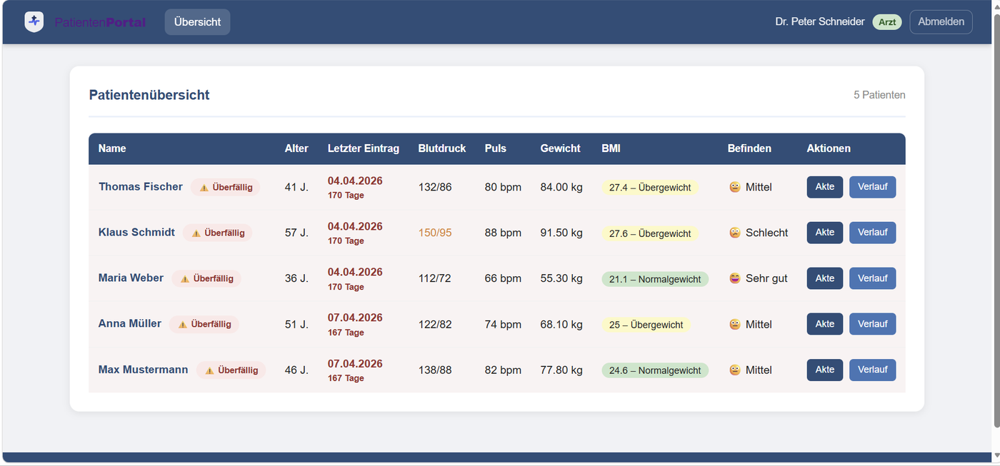
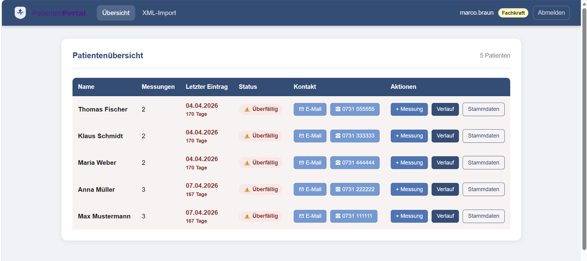
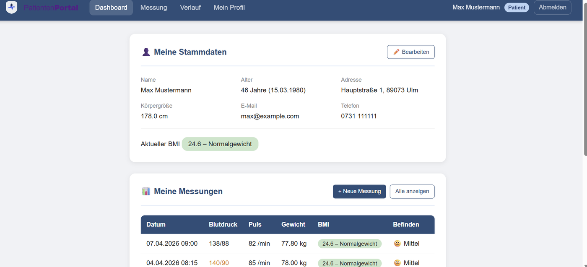
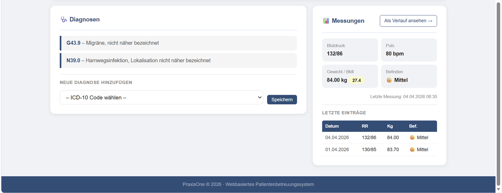
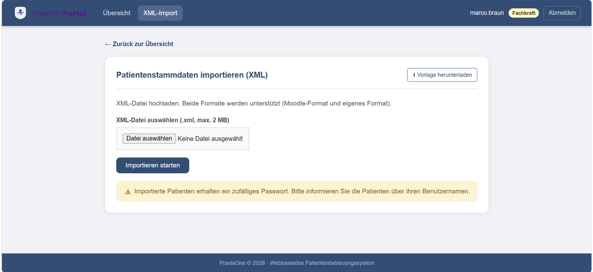
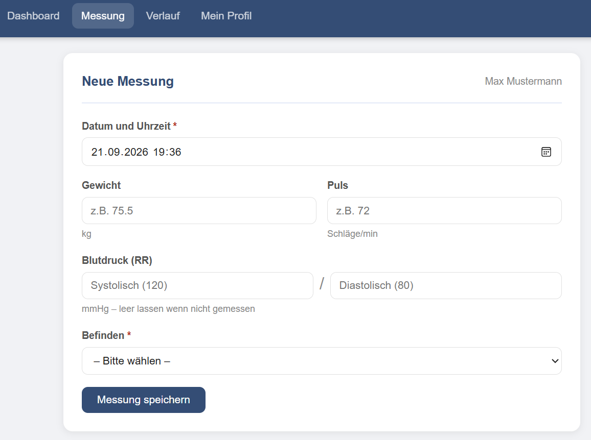

# 🏥 PraxisOne – Patientenportal

PraxisOne ist ein webbasiertes Patientenportal für eine Arztpraxis. Patienten erfassen ihre Vitalwerte selbst, Fachkräfte pflegen Stammdaten und Ärzte dokumentieren Diagnosen – alles rollenbasiert in einer Anwendung.

> **Hinweis:** Dies ist ein Lern- bzw. Semesterprojekt. Alle Personen und Daten in der Beispieldatenbank sind frei erfunden. Die Anwendung ist **nicht** für den Betrieb mit echten Patientendaten gedacht (siehe [Sicherheitshinweise](#-sicherheitshinweise)).

## ✨ Funktionen

Das Portal kennt drei Rollen:

| Rolle | Kürzel | Funktionen |
|---|---|---|
| **Patient** | `Pat` | Eigenes Dashboard (Stammdaten, Messungen, Diagnosen), Messwerte eintragen (Gewicht, Blutdruck, Puls, Befinden), Verlaufsansicht, Profil bearbeiten |
| **Fachkraft** | `Ass` | Patientenübersicht, Stammdaten bearbeiten, Messungen für Patienten erfassen, **XML-Import** von Patienten |
| **Arzt** | `Arzt` | Patientenübersicht, digitale Patientenakte, Diagnosen per ICD-10-Code zuordnen, Messwerte einsehen |

Welche Rolle jemand hat, wird beim Anlegen des Benutzers in der Datenbank festgelegt (Spalte `Rolle` in der Tabelle `benutzer`). Eine Selbstregistrierung mit Rollenwahl gibt es nicht – Patienten, Fachkräfte und Ärzte werden von der Praxis eingetragen.

Weitere Merkmale:

- **Automatische BMI-Berechnung** mit Farbskala (Untergewicht / Normal / Übergewicht / Adipositas)
- **Blutdruck-Warnstufen** (normal / erhöht / kritisch)
- **„Überfällig“-Markierung**: Ein Patient gilt als überfällig, wenn seit über 7 Tagen keine neue Messung eingetragen wurde (oder noch nie eine). Er erscheint dann in der Übersicht von Fachkraft und Arzt rot markiert und ganz oben in der Liste.
- **Kontakt direkt aus der Übersicht**: Die Buttons „E-Mail“ und „Telefon“ nutzen `mailto:`- und `tel:`-Links. Sie öffnen also das auf dem jeweiligen Rechner hinterlegte Standardprogramm (z. B. Outlook oder Teams) – das ist normales Browserverhalten und keine Fehlfunktion der Anwendung.
- **XML-Import** für Patientenlisten inkl. Vorlagen-Download (Groß-/Kleinschreibung der Tags wird toleriert). Neu importierte Patienten erhalten automatisch einen Benutzernamen und ein zufälliges Passwort.
- Registrierung ist bewusst deaktiviert – Patienten werden von der Praxis angelegt

## 🖼️ Screenshots

| Arzt-Ansicht | Fachkraft-Ansicht | Patienten-Ansicht |
|---|---|---|
|  |  |  |
| Patientenübersicht mit Überfällig-Markierung | Patientenübersicht mit Kontakt-Buttons | Eigene Stammdaten und Messungen |
|  |  |  |
| Digitale Akte mit ICD-10-Diagnosen | Import von Patientenstammdaten per XML | Eigene Messwerte eintragen |

Alle gezeigten Personen und Werte stammen aus der mitgelieferten Beispieldatenbank und sind frei erfunden.

## 🛠️ Technologien

- PHP 8.0+ (nutzt `match` und `str_contains`)
- MySQL / MariaDB (Zugriff über PDO)
- HTML5 & CSS3 (kein Framework)

## 📁 Projektstruktur

```
PraxisOne/
├── Assets/css/style.css        # Styling
├── Config/db.php               # Datenbankverbindung
├── Includes/
│   ├── auth.php                # Sessions, Rollenprüfung, CSRF-Schutz
│   ├── functions.php           # BMI, Blutdruck, Formatierung, XML-Vorlage
│   ├── header.php              # Navigation
│   └── footer.php
├── database/praxisone.sql      # Datenbankschema + Beispieldaten
├── index.html                  # Startseite
├── login.php / logout.php      # Anmeldung
├── dashboard_patient.php       # Patienten-Dashboard
├── dashboard_fachkraft.php     # Fachkraft-Übersicht
├── dashboard_arzt.php          # Arzt-Übersicht
├── patient_detail.php          # Patientenakte (Arzt)
├── messung.php                 # Messwerte eintragen
├── verlauf.php                 # Verlauf der Messwerte
├── stammdaten_bearbeiten.php   # Profil bearbeiten (Patient)
├── stammdaten_fachkraft.php    # Stammdaten bearbeiten (Fachkraft)
├── xml_import.php              # XML-Import (Fachkraft)
└── passwort_setup.php          # Einmaliges Setup der Demo-Passwörter
```

## 🚀 Installation (lokal)

**Voraussetzungen:** XAMPP, WAMP oder MAMP mit PHP 8.0+ und MySQL/MariaDB.

1. **Repository klonen** bzw. entpacken – in den Webserver-Ordner (z. B. `htdocs/PraxisOne`):
   ```bash
   git clone https://github.com/<dein-benutzername>/PraxisOne.git
   ```
2. **Datenbank anlegen:** `database/praxisone.sql` in phpMyAdmin importieren (das Skript erstellt die Datenbank `praxisone` automatisch).
3. **Zugangsdaten prüfen:** In `Config/db.php` stehen die Standardwerte für XAMPP/WAMP (`root`, leeres Passwort). Bei Bedarf anpassen.
4. **Demo-Passwörter setzen:** Einmalig `http://localhost/PraxisOne/passwort_setup.php` im Browser aufrufen. Die Beispieldaten enthalten nur Platzhalter-Hashes, dieses Skript trägt echte Hashes ein.
5. **⚠️ `passwort_setup.php` danach löschen** (siehe Sicherheitshinweise).
6. **Anmelden:** `http://localhost/PraxisOne/login.php`

## 👤 Demo-Zugänge

Nach Schritt 4 stehen diese Testkonten zur Verfügung:

| Rolle | Benutzername | Passwort |
|---|---|---|
| Patient | `max.mustermann` | `Pat123!` |
| Patient | `anna.mueller` | `Pat123!` |
| Fachkraft | `lisa.klein` | `Ass123!` |
| Arzt | `dr.schneider` | `Arzt123!` |
| Arzt | `dr.hoffmann` | `Arzt123!` |

Weitere Patienten (`klaus.schmidt`, `maria.weber`, `thomas.fischer`) und eine weitere Fachkraft (`marco.braun`) sind in der Beispieldatenbank ebenfalls vorhanden.

## 🔒 Sicherheitshinweise

Umgesetzt sind u. a.: Prepared Statements (PDO), Passwort-Hashing mit bcrypt, CSRF-Token, rollenbasierte Zugriffskontrolle, `HttpOnly`/`SameSite`-Cookies und Session-Timeout nach 30 Minuten.

Vor jedem Einsatz außerhalb der lokalen Entwicklung gilt:

- **`passwort_setup.php` löschen.** Das Skript setzt ohne Anmeldung alle Passwörter zurück und zeigt sie im Klartext an.
- **Eigenen Datenbankbenutzer anlegen** statt `root` ohne Passwort (Anleitung als Kommentar in `Config/db.php`).
- **HTTPS aktivieren** und in `Includes/auth.php` das Cookie-Flag `secure` auf `true` setzen.
- **Demo-Passwörter ändern.**
- Gesundheitsdaten sind besonders geschützte Daten (Art. 9 DSGVO). Für einen echten Praxisbetrieb wären weitere Maßnahmen nötig (Verschlüsselung, Protokollierung, Datenschutzkonzept, …).

## 📝 Lizenz

Noch keine Lizenz festgelegt.
